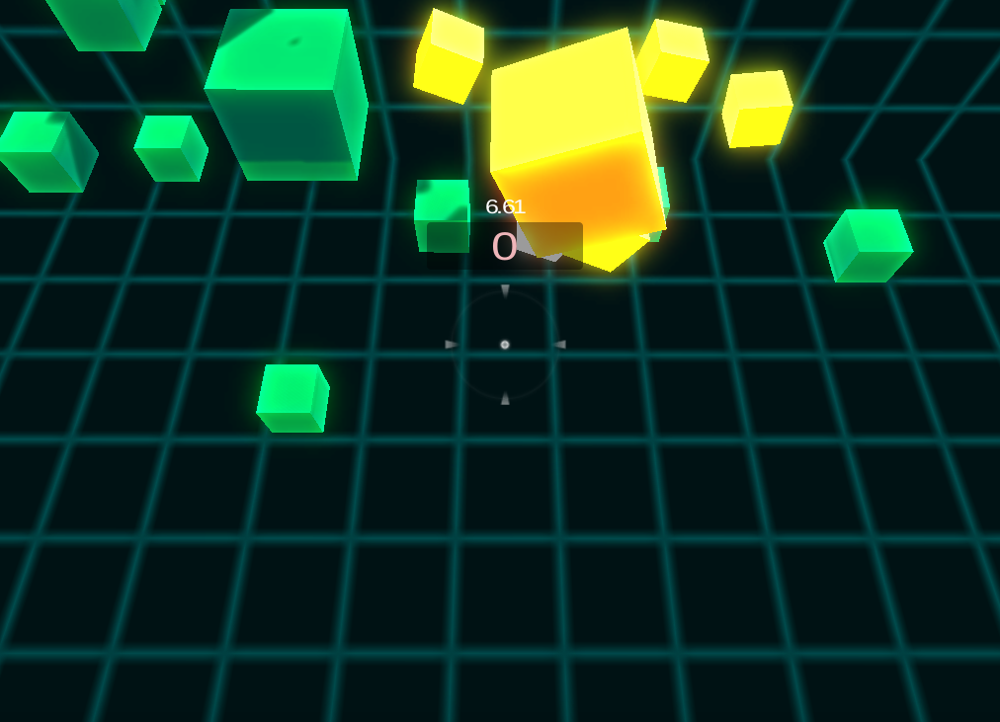
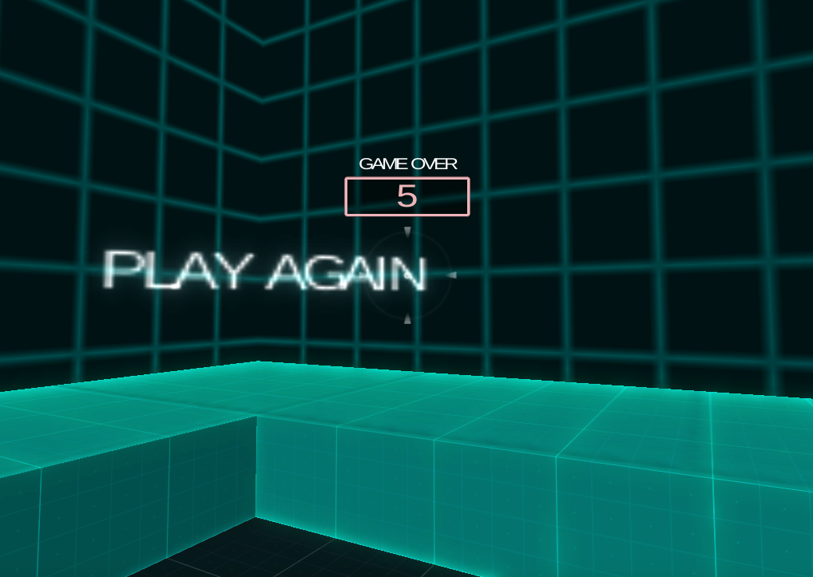
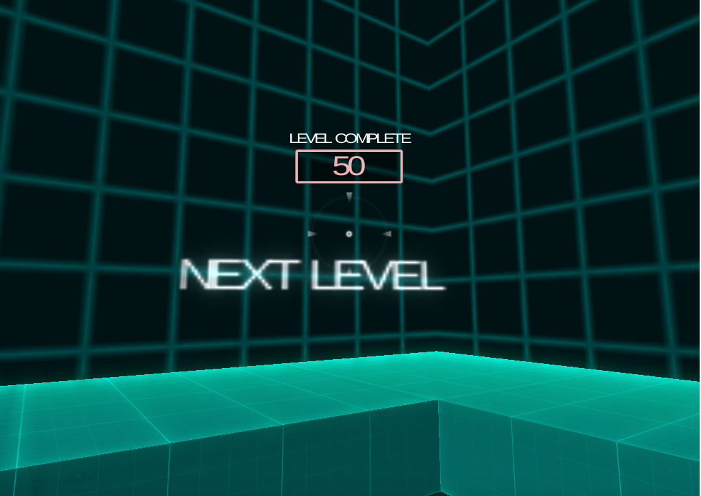
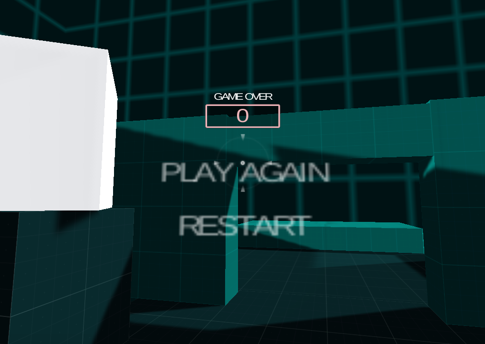

# Box-Shooter

Here the player is challenged with shooting moving boxes while taking into account their color. Shooting some boxes adds points, while shooting others takes away time. The player must shoot the right colored boxes to score enough points after which they can advance to the next level.

The second level adds a new element of giving the player access to movement, forcing players to move and shoot to get around obstacles.

### Instructions
1. Download the .zip file and extract to your system
2. Play by opening the `index.html` file located in the Builds/WebGL folder.

### Screenshots

